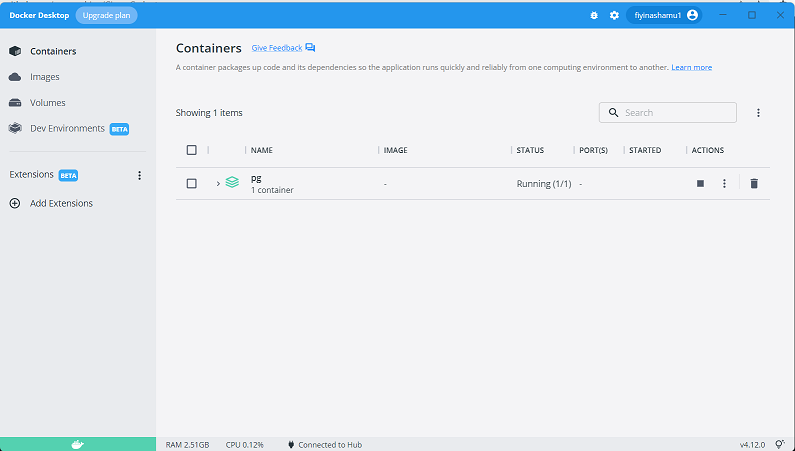

# Data-Warehouse-Challenge-2021-Jr-Data-Engineer

# Project Overview

The objective of this project was to extract data from two endpoints. The datasets were then transformed into three tables (Users, subscription, and messages) to produce metrics based on these columns ( date, age, city, country, email domain, gender, smoking condition, income, subscriptions and messages) for analytics. The ETL pipeline was built using Python, Docker, and PostgreSQL.

## Process

Extract data from two endpoints with Python and Pandas, upload the raw data to a PostgreSQL database running in a Docker container.

## Set Up

### setting up the PostgreSQL database

Created a .env file in the project directory. This file contains the PostgreSQL database credentials which are needed in the docker-compose.yml file I created in the next step.

Created a docker-compose.yaml file that contains all the necessary information to run the PostgreSQL container.

Before running the container, I created a db_management.py file that contains the SQL command to create the database.

## Data Modelling
Using the  datasets, I created db schema optimized for queries for analysis, which includes the tables mentioned above.

Diagram created using [ERD Plus](https://erdplus.com)

## Installation

This project uses Python 3, along with Spyder. The following libraries were necessary for running the code:

## Extract, Transform and Load

Required libraries imported

> - logging
> - os
> - psycopg2
> - configparser
> - requets

Created a connection to the Postgres database

## Test
